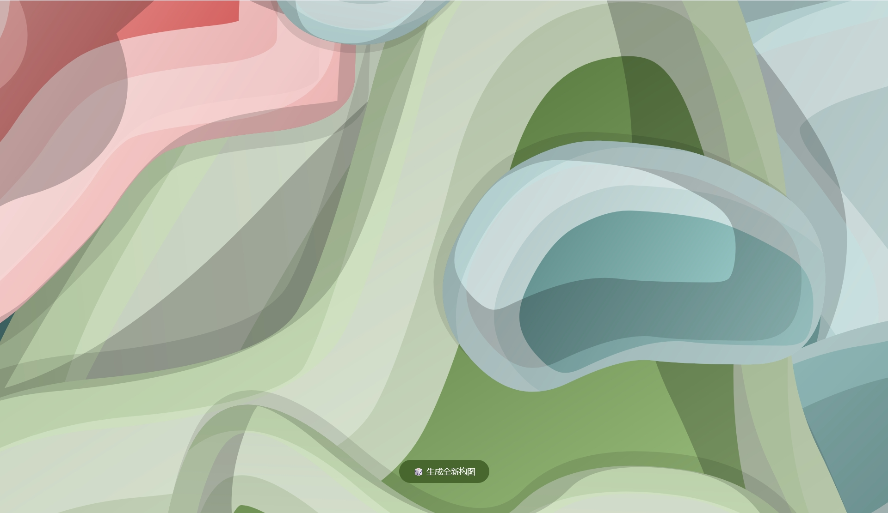
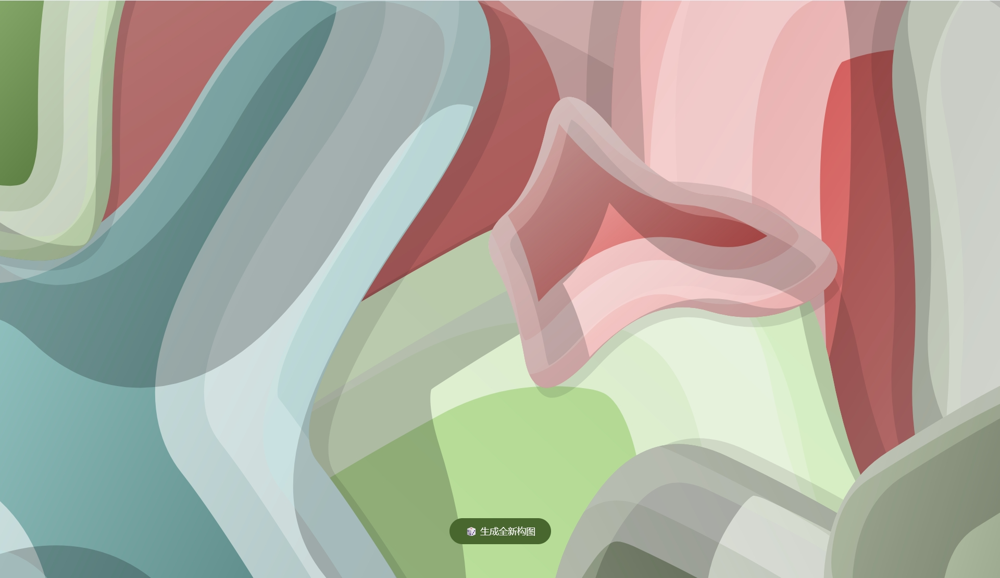

# KMP-DynamicWallpaper

基于向量叠加算法编写的 MD3 抽象风格壁纸生成组件，纯 CommonMain 实现。

## 预览

| | | |
|---|---|---|
|  |  |  |

## 使用方法

复制 `DynamicWallpaper.kt` 到你的项目中。

### 签名

```kotlin
@Composable
fun ClayFluidWallpaper(
    scheme: ColorScheme,
    modifier: Modifier = Modifier,
    blurSize: Dp = 12.dp,
    onControllerReady: (DynamicWallpaper) -> Unit = {},
)
```

### 示例

```kotlin
Box(modifier = Modifier.fillMaxSize()) {
    var wallpaperController by remember {
        mutableStateOf<DynamicWallpaper?>(null)
    }

    ClayFluidWallpaper(
        scheme = MaterialTheme.colorScheme,
        blurSize = 1.dp,
        onControllerReady = { controller ->
            wallpaperController = controller
        }
    )

    Button(
        onClick = { wallpaperController?.randomize() },
        modifier = Modifier
            .align(Alignment.BottomCenter)
            .padding(bottom = 48.dp)
    ) {
        Text("🎲 生成全新构图")
    }
}
```

## 参数

| 参数 | 类型 | 默认值 | 说明 |
|------|------|--------|------|
| `scheme` | `ColorScheme` | 必填 | MD3 配色方案，壁纸色彩从此派生 |
| `modifier` | `Modifier` | `Modifier` | 标准 Compose 修饰符 |
| `blurSize` | `Dp` | `12.dp` | 整体模糊强度，值越小轮廓越清晰 |
| `onControllerReady` | `(DynamicWallpaper) -> Unit` | `{}` | 控制器回调，用于调用 `randomize()` 重新构图 |
